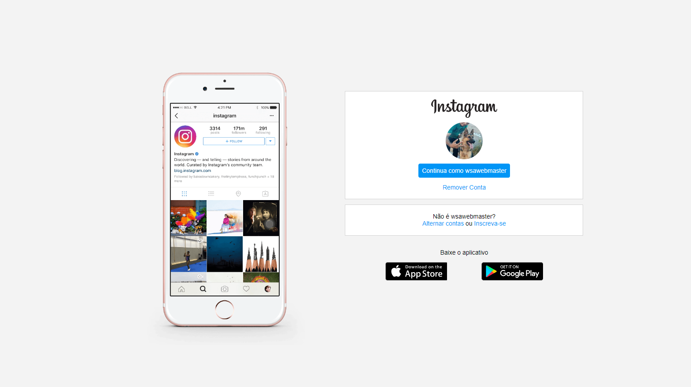

# 📂 Clone Instagram

## 📃 Projeto desenvolvido em treinamento realizado na plataforma DIO.

 

## 🚀 Tecnologias

- HTML
- CSS
- Git e Github

 

## 💻 Projeto
> Frontend da aplicação 📸

  

[Acessar o projeto](https://wsawebmaster.github.io/instagram-clone-dio/)

 

---
---
## 📧 Contato
wsawebmaster@yahoo.com.br
